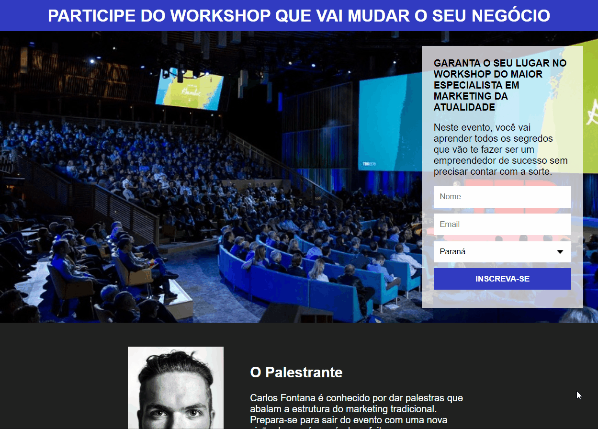

# :computer: Project
O projeto consiste em desenvolver uma Página de Captura. A página divulga um WorksShop fictício, integrando o formulário com o mailchimp.

## :arrow_forward: Resultado do Projeto

  

--

  

## :rocket: Tecnologias Utilizadas
* HTML
* CSS
* **Serviço:** [Mailchimp](https://mailchimp.com/)
